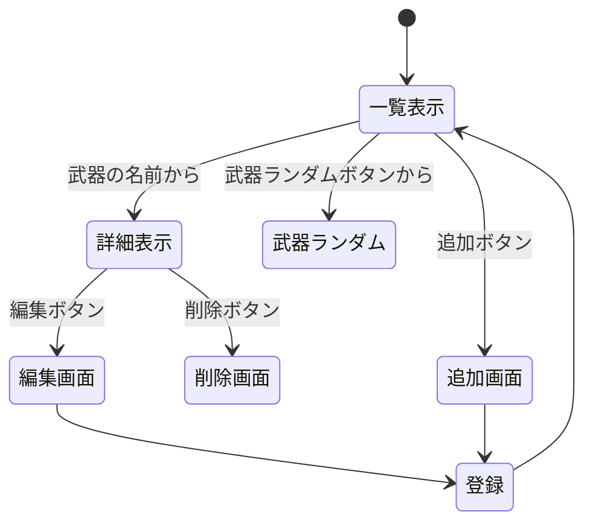
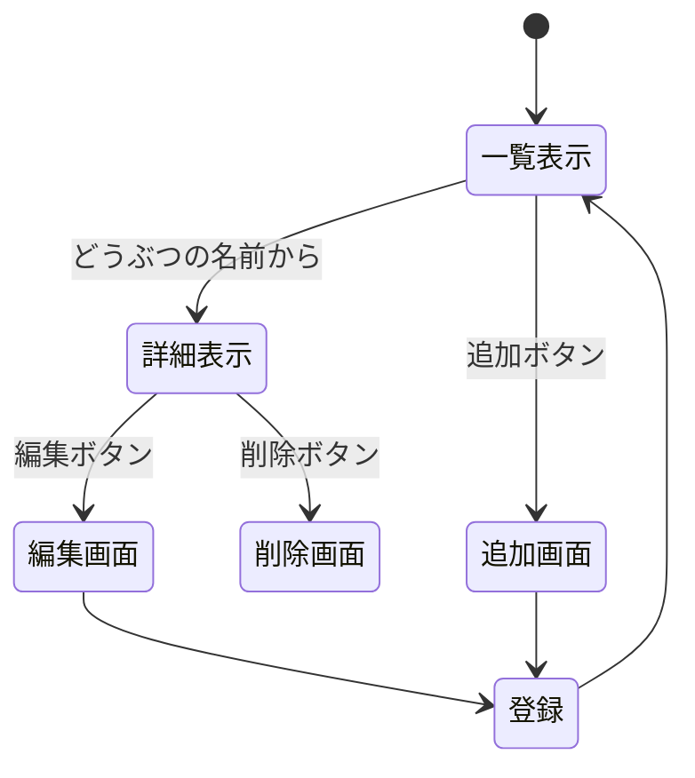
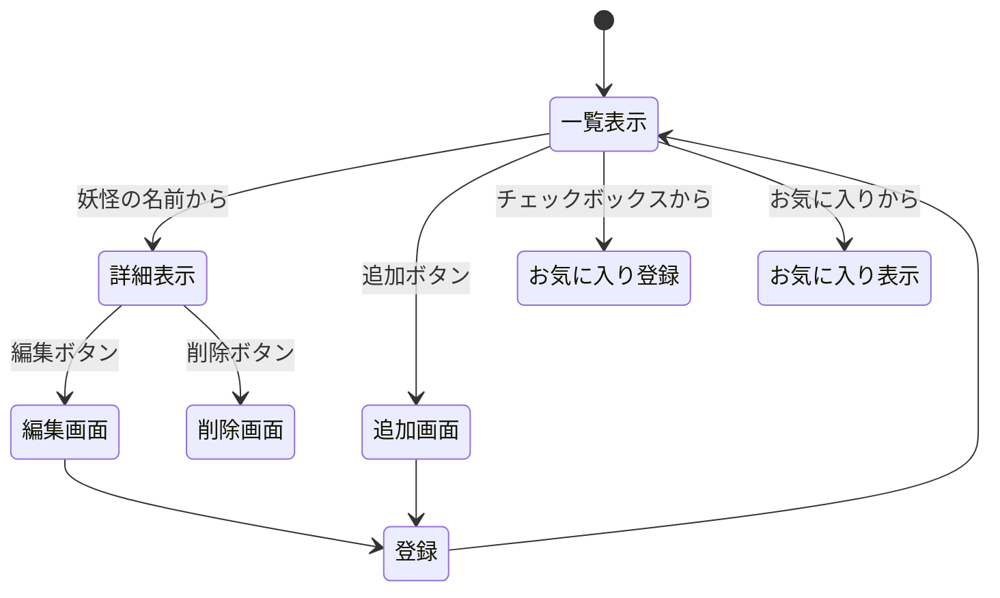

# スプラトゥーン武器管理システム

## 概要
本システムはスプラトゥーン3の武器データの一覧表示，詳細表示，新規登録，編集，削除，武器ランダムを行うWebアプリケーションである．

## 1．データ構造

プロパティ名 | 型 | 説明 
-|-|-
`id` |integer|ID
`name`|string|武器の名前
`sub`|string|サブウェポン
`special`|string|スペシャルウェポン

### データ例
```text
"id":1
"name":"スプラシューター"
"sub":"キューバンボム"
"special":"ウルトラショット"
```

## 2. ページ遷移とルーティング



機能 | HTTPメソッド | リソース名(url)| 画面遷移の方法|処理・表示内容 
-|-|-|-|-
一覧表示|GET|/spl|初期のアクセス，一覧に戻るのリンク|登録されている武器の一覧表示
詳細表示|GET|/spl/:id|一覧画面で武器の名前をクリック|指定した武器の詳細を表示する
新規登録画面|GET|/spl/create|一覧画面で新規作成ボタンをクリック|入力フォームを表示する
新規登録処理|POST|/spl|登録画面で保存ボタンをクリック|新しいIDをつけて配列に追加し一覧画面にリダイレクトする
編集画面|GET|/spl/edit/:id|詳細画面で編集ボタンをクリック|既存のデータを埋め込んだフォームを表示する
更新処理|POST|/spl/update/:id|編集ボタンをクリック|対象のIDのデータを書き換えて詳細画面へリダイレクトする
削除処理|POST|/spl/delete/:id|詳細画面で削除ボタンをクリック|対象IDのデータを配列から削除して一覧画面へリダイレクトする
ランダム選択|GET|/spl/random|一覧画面で武器ランダムボタンをクリック|サーバー側でランダムに武器を選択しその武器の詳細画面に移動するようにする

## 3. リソースごとの機能の詳細
`/spl`（GET）
・機能：サーバー内のデータ配列を取得し，ejsテンプレートに渡してレンダリングする．
・表示：武器のID，名前を表示する．
`/spl/:id`（GET）
・機能：URLパラメータの:idと一致するデータを配列から検索する．
・表示：詳細について記述してあるejsから武器の名前，サブ，スペシャルを表示する．一覧に戻るボタンを配置する．
`/spl`（POST）
・機能：フォームから送信されたデータを受け取り新しいIDを生成して新しいオブジェクトを作成する．
・遷移：処理終了後，一覧にリダイレクトする
`/spl/update/:id`
・機能：URLパラメータの:idを利用して編集対象となるデータを配列から検索する．取得したデータをejsテンプレートに渡す．
・表示：ユーザーがデータを修正し，更新ボタンを押すことによってデータが送信される．
`/spl/update/:id`（POST）
・機能：URLパラメータの:idに該当するデータを配列から特定する．フォームから送信された新しい値で対象オブジェクトを上書きする．
・遷移：処理終了後詳細画面へリダイレクトする
`/spl/delete/:id`（POST）
・機能：URLパラメータの:idに該当するデータを配列から検索して除外する．
・遷移：処理終了後一覧画面にリダイレクトする
`/spl/random`（POST）
・機能：サーバー内のデータからMath.random()を利用してランダムに一つを選択して表示する．
・遷移：選択した書籍のIDを取得し詳細画面へリダイレクトする．

# すいーとぽて島のどうぶつたち

## 概要
本システムはあつまれどうぶつの森の島にいるどうぶつたちの一覧表示，新規登録，編集，削除を行うWebアプリケーションである．

## 1．データ構造

プロパティ名 | 型 | 説明 
-|-|-
`id` |integer|ID
`name`|string|どうぶつの名前
`type`|string|どうぶつの種類
`character`|string|性格
`birthday`|string|誕生日

### データ例
```text
"id":1
"name":"1ごう"
"type":"猫"
"character":"ハキハキ"
"birthday":"8月1日"
```

## 2. ページ遷移とルーティング

機能 | HTTPメソッド | リソース名(url)| 画面遷移の方法|処理・表示内容 
-|-|-|-|-
一覧表示|GET|/animal|初期のアクセス，一覧に戻るのリンク|登録されているどうぶつの一覧表示
詳細表示|GET|/animal/:id|一覧画面でどうぶつの名前をクリック|指定したどうぶつの詳細を表示する
新規登録画面|GET|/animal/create|一覧画面で新規作成ボタンをクリック|入力フォームを表示する
新規登録処理|POST|/animal|登録画面で保存ボタンをクリック|新しいIDをつけて配列に追加し一覧画面にリダイレクトする
編集画面|GET|/animal/edit/:id|詳細画面で編集ボタンをクリック|既存のデータを埋め込んだフォームを表示する
更新処理|POST|/animal/update/:id|編集ボタンをクリック|対象のIDのデータを書き換えて詳細画面へリダイレクトする
削除処理|POST|/animal/delete/:id|詳細画面で削除ボタンをクリック|対象IDのデータを配列から削除して一覧画面へリダイレクトする


## 3. リソースごとの機能の詳細
`/animal`（GET）
・機能：サーバー内のデータ配列を取得し，ejsテンプレートに渡してレンダリングする．
・表示：どうぶつのID，名前を表示する．
`/animal/:id`（GET）
・機能：URLパラメータの:idと一致するデータを配列から検索する．
・表示：詳細について記述してあるejsからどうぶつの名前，種類，性格，誕生日を表示する．一覧に戻るボタンを配置する．
`/animal`（POST）
・機能：フォームから送信されたデータを受け取り新しいIDを生成して新しいオブジェクトを作成する．
・遷移：処理終了後，一覧にリダイレクトする
`/animal/update/:id`
・機能：URLパラメータの:idを利用して編集対象となるデータを配列から検索する．取得したデータをejsテンプレートに渡す．
・表示：ユーザーがデータを修正し，更新ボタンを押すことによってデータが送信される．
`/animal/update/:id`（POST）
・機能：URLパラメータの:idに該当するデータを配列から特定する．フォームから送信された新しい値で対象オブジェクトを上書きする．
・遷移：処理終了後詳細画面へリダイレクトする
`/animal/delete/:id`（POST）
・機能：URLパラメータの:idに該当するデータを配列から検索して除外する．
・遷移：処理終了後一覧画面にリダイレクトする

# 妖怪ウォッチキャラリスト

## 概要
本システムは妖怪ウォッチのキャラの一覧表示，新規登録，編集，削除に加えお気に入り登録を行うWebアプリケーションである．

## 1．データ構造

プロパティ名 | 型 | 説明 
-|-|-
`id` |integer|ID
`name`|string|妖怪の名前
`type`|string|妖怪の種族
`rank`|string|ランク
`skill`|string|スキル
`soultimate move`|string|必殺技
`favorite`|boolean|お気に入り登録状態

### データ例
```text
"id":1
"name":"ジバニャン"
"type":"プリチー"
"rank":"D"
"skill":"まえのめり"
"soultimate move":"ひゃくれつ肉球"
"favorite": true
```

## 2. ページ遷移とルーティング

機能 | HTTPメソッド | リソース名(url)| 画面遷移の方法|処理・表示内容 
-|-|-|-|-
一覧表示|GET|/youkai|初期のアクセス，一覧に戻るのリンク|登録されている妖怪の一覧表示
詳細表示|GET|/youkai/:id|一覧画面で妖怪の名前をクリック|指定した妖怪の詳細を表示する
新規登録画面|GET|/youkai/create|一覧画面で新規作成ボタンをクリック|入力フォームを表示する
新規登録処理|POST|/youkai|登録画面で保存ボタンをクリック|新しいIDをつけて配列に追加し一覧画面にリダイレクトする
編集画面|GET|/youkai/edit/:id|詳細画面で編集ボタンをクリック|既存のデータを埋め込んだフォームを表示する
更新処理|POST|/youkai/update/:id|編集ボタンをクリック|対象のIDのデータを書き換えて詳細画面へリダイレクトする
削除処理|POST|/youkai/delete/:id|詳細画面で削除ボタンをクリック|対象IDのデータを配列から削除して一覧画面へリダイレクトする
お気に入り一覧表示|GET|/youkai/favorites|一覧画面でお気に入り一覧リンクをクリック|お気に入り状態の妖怪のみをリストにする


## 3. リソースごとの機能の詳細
`/youkail`（GET）
・機能：サーバー内のデータ配列を取得し，ejsテンプレートに渡してレンダリングする．
・表示：どうぶつのID，名前を表示する．
`/youkai/:id`（GET）
・機能：URLパラメータの:idと一致するデータを配列から検索する．
・表示：詳細について記述してあるejsからどうぶつの名前，種類，性格，誕生日を表示する．一覧に戻るボタンを配置する．
`/youkai`（POST）
・機能：フォームから送信されたデータを受け取り新しいIDを生成して新しいオブジェクトを作成する．
・遷移：処理終了後，一覧にリダイレクトする
`/youkai/update/:id`
・機能：URLパラメータの:idを利用して編集対象となるデータを配列から検索する．取得したデータをejsテンプレートに渡す．
・表示：ユーザーがデータを修正し，更新ボタンを押すことによってデータが送信される．
`/youkai/update/:id`（POST）
・機能：URLパラメータの:idに該当するデータを配列から特定する．フォームから送信された新しい値で対象オブジェクトを上書きする．
・遷移：処理終了後詳細画面へリダイレクトする
`/youkai/delete/:id`（POST）
・機能：URLパラメータの:idに該当するデータを配列から検索して除外する．
・遷移：処理終了後一覧画面にリダイレクトする
`/youkai/favorites`(GET)
・機能：favoriteがtrueの妖怪だけを抽出し，テンプレートに渡してレンダリングする
・表示：お気に入りに登録されている妖怪のみを一覧表示する